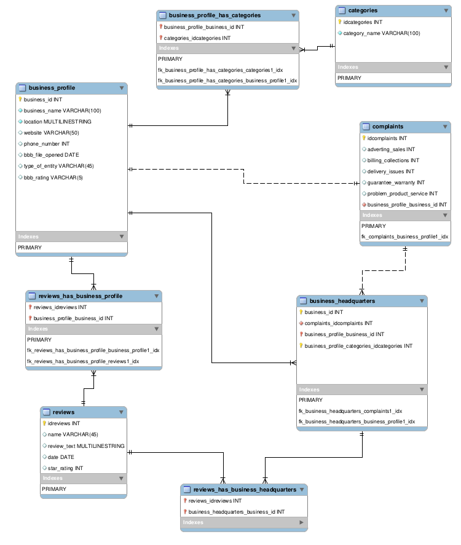

# BBB.org Scraper: A data mining project!

## Requirements

* Python 3.8 or higher (this scraper was built on Python 3.9.1 on a Xubuntu 20.10)

----

## Legal Notices

This scraper was built purely for academic purposes. 

By using this scraper, you are using and accessing the database of the Better Business Bureau and the Yelp API and therefore abide by their respective Terms of Use, which are linked below
* [Yelp API Terms of Use](https://www.yelp.com/developers/api_terms)
* [BBB Terms of Use](https://www.bbb.org/terms-of-use)

### Data Storage

The Yelp API Terms of Use Section 5a states that

> You agree that you will not, and will not assist or enable others to:    
> cache, record, pre-fetch, or otherwise store any portion of the Yelp Content for a period longer than twenty-four (24) hours from receipt of the Yelp Content, or attempt or provide a means to execute any scraping or "bulk download" operations, with the exception of using the Yelp Content to perform non-commercial analysis (as further explained below) or storing Yelp business IDs which you may use solely for back-end matching purposes;

**If any of the `YelpRequester` classes are used to update the SQL tables, please delete any and all data generated by this scraper within 24 hours.** 

As the scraper is intended to be run once to build the tables and not meant to be run continuously, the scraper cannot to do this automatically and relies on the end user to perform the deletion themselves.

### In conjunction with competitors

According to the Yelp API Terms of Use Section 5c,

> You agree that you will not, and will not assist or enable others to:      
> display or use Yelp user review ratings (numerical, star or any other representation of the Yelp user review rating calculation) alongside or in conjunction with other user-generated content (i.e. don’t use Yelp user review ratings for the benefit of a Yelp competitor);

however, as BBB is a non-profit organization, it should not count as a Yelp competitor.

**Disclaimer: I am not a lawyer. Feel free to correct me.**

----

## Current Features

Features

## Installation

Create a virtual environment if you want to, it's generally not a bad idea.

Use `pip install -r requirements.txt` to fix dependency issues

## Usage

* set up the dependencies and the config files
* edit `internal_config.py` if the SQL database user is not `root`
* run `python3 main.py CATEGORY`
* Enter SQL password when prompted

### Optional CLI arguments
`-v` prints verbose output (i.e., outputs debug logs into terminal)  
`-c` uses a config file instead of reading CLI arguments (**not implemented yet**)  
`-l FILENAME` or `--log FILENAME` outputs program logs into a file (default is log.txt)  
`-t TYPE` or `--type TYPE` output to file type (default is SQL. only SQL is implemented at the moment)

`--lim INT` limit the number of companies scraped (**not implemented yet**)  
`--loc LOCATION` scrape companies from a certain country (default: US)  
`--acc` get accredited companies only  
`--all` scrape all companies in all categories (**not implemented yet**)  -- WILL DISABLE ALL YELP-RELATED FEATURES IF USED

----

## Scraper Information

## Database information

----

## current problems
* something is off with the number of companies scraped by categoryscraper...
* Only output to SQL is implemented
* does not handle full hours of operation
* does not check for multiple locations (will produce duplicates instead)
* only the `business_profile` and `categories` tables are populated
* some issues with scraping the company website and BBB rating 

## planned features
* support for scraping charities
* scrape everything option

## version history
* 2021 may 08 - also scrapes reviews from yelp  
* 2021 apr 02 - now handles arguments!  
* 2021 feb 21 - only scrapes some companies from one category. output only to json

## Credits
* Social media preview: Photo by Markus Spiske on Unsplash